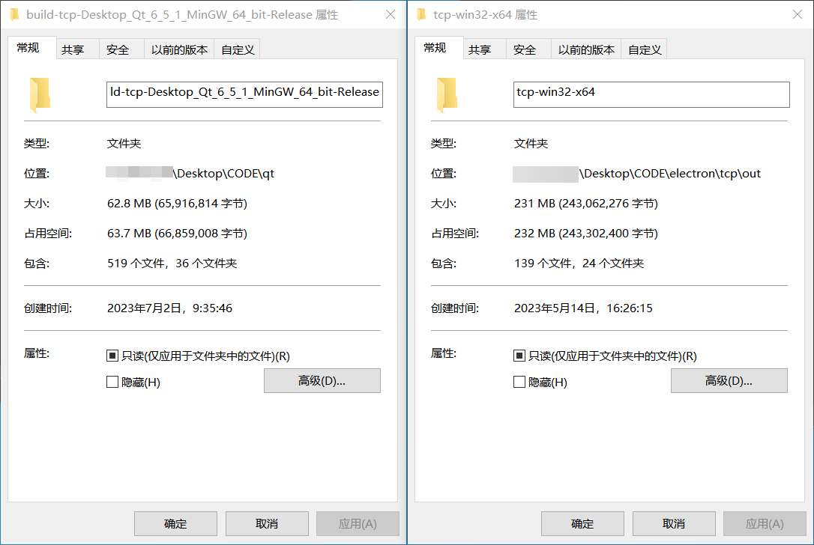
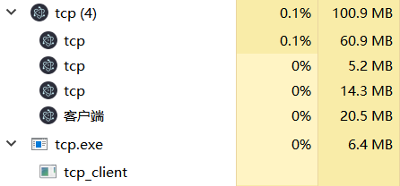
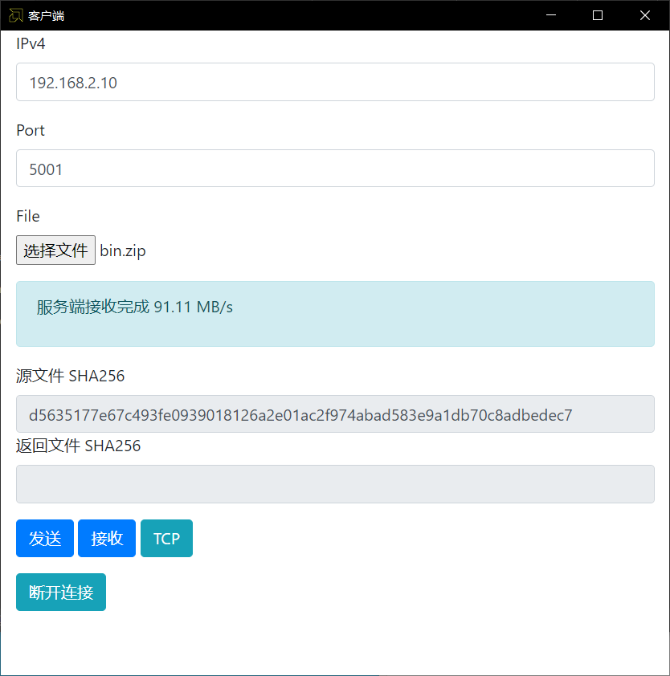
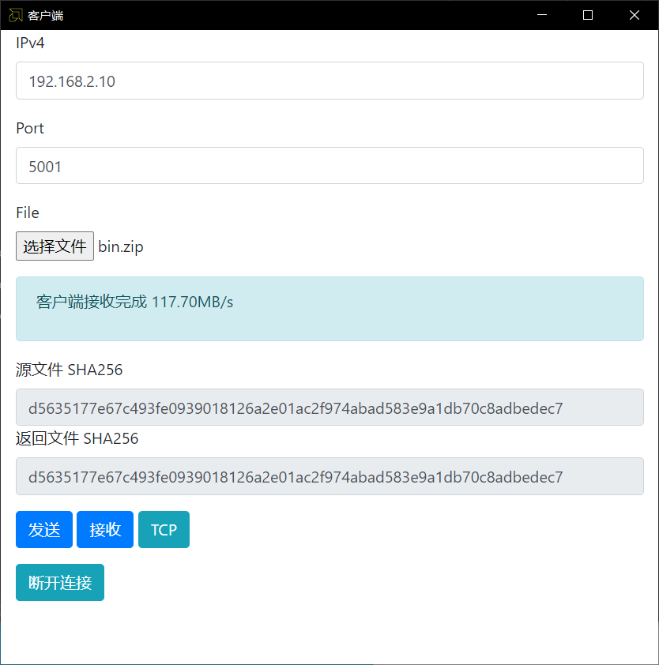
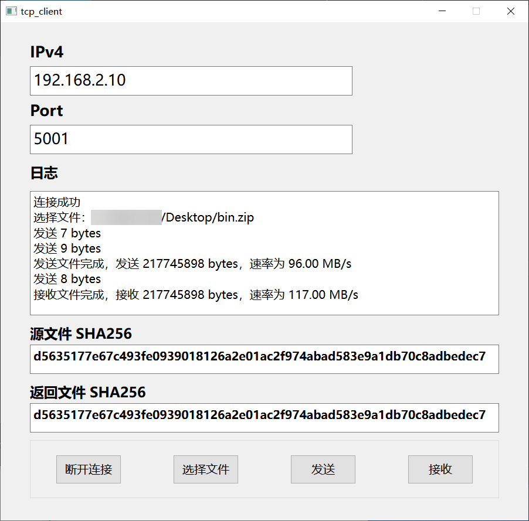
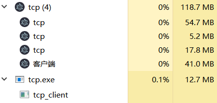

# qt_vs_electron

对比使用 Qt6 和 Electron 编写的毕设程序

使用 Electron 和 Qt6 编写了同样功能的客户端程序，主要使用了双发提供的图形化界面和网络功能，下面对两个程序进行对比。

---

### 1. 发布文件大小

Qt6 的发布文件占用磁盘 63.7 MB，Electron 的发布文件占用磁盘 232 MB，Electron 塞了个 Chromium 核心确实占硬盘。

### 2. 启动时占用的内存

Electron 版本的程序一启动就占用了 100.9 MB 运行内存，而 Qt6 版本的仅占用 6.4 MB 运行内存，谁才是小而美？

### 3. 性能对比

#### 3.1 Electron 版本

与开发板的网路通信中，发送速率为 91.11 MB/s，接收速率为 117.70 MB/s

#### 3.2 Qt6版本

与开发板的网络通信中，发送速率为 96 MB/s，接收速率为 117 MB/s

#### 3.3 一个运行周期后内存占用

Electron 版本的内存占用来到了 118.7 MB，而 Qt6 版本的内存占用仅 12.7 MB

### 4 结论

实现毕设需求同样的功能，Qt6 版本的程序在磁盘占用和内存使用上对比 Electron 版本有巨大优势，在性能上 Qt6 同样略胜一筹。
